# Architecture

The diagrams below render directly on GitHub. Click any diagram for its full-size SVG. The [FSM reference](diagrams/state-transitions.md) lists every allowed target. Each SVG has a matching editable JSON source in `docs/diagrams/`.

**Diagram scope:** the diagrams, their JSON/SVG labels, and the revision-pinned FSM reference show historical topology before Phase 6. Legacy paths and lifecycle ownership in those artifacts are not current; the implementation paths and four-surface lifecycle descriptions below supersede them where they differ.

Delhi Scheme Saathi is a Python 3.11 FastAPI application for welfare-scheme guidance through Telegram and a direct chat API. It supports Hindi, English, and Hinglish. It provides recommendations and application guidance; it does not submit applications or transfer a conversation to a human operator.

## Migration state

Phase 4 domain extraction was merged in [PR #5](https://github.com/Vansh-Sharma27/delhi-scheme-saathi-2.0/pull/5). Phase 5 application and interface extraction was merged in [PR #7](https://github.com/Vansh-Sharma27/delhi-scheme-saathi-2.0/pull/7). Phase 6 composition-root work is implemented on `arch/phase-6-composition-root` and remains unpublished pending review. Conversation analysis, language selection and enforcement, profile updates, transition/reset decisions, turn/snapshot rendering, commands, persistence, compact memory, AI task policy, and matching orchestration are application services. Guidance is split into localization, templates, presenters, currency formatting, and generation. HTTP and Telegram adapters live in `src/dss/interfaces`; construction and resource ownership live in `src/dss/bootstrap`.

| Area | Current implementation |
| --- | --- |
| Domain profiles and required-field policy | `src/dss/domain/profiles/` |
| Domain schemes, documents, offices, rejection rules | `src/dss/domain/schemes/` |
| Conversation state, session, memory, shared clock type | `src/dss/domain/conversations/` |
| Eligibility evaluation | `src/dss/domain/eligibility/evaluator.py` |
| Application ports | `src/dss/application/ports/` |
| SQL repositories, pool-holding adapters, catalog loading, scheme hydration | `src/dss/infrastructure/database/` |
| Session stores, clock adapter, persisted-state repair | `src/dss/infrastructure/sessions/` |
| Queue adapters and payload codec | `src/dss/infrastructure/queues/` |
| AI providers and unchanged prompt templates | `src/dss/infrastructure/ai/` |
| Embeddings and speech adapters | `src/dss/infrastructure/embeddings/`, `src/dss/infrastructure/speech/` |
| Conversation application use cases and result models | `src/dss/application/conversation/` |
| Localization, response templates, presenters, generation, currency formatting | `src/dss/application/guidance/` |
| Presentation facts derived from the existing evaluator | `src/dss/domain/eligibility/presentation_facts.py` |
| AI usage telemetry | `src/dss/observability/llm_usage.py` |
| Conversation application graph and shared views | `src/dss/application/conversation/`, `src/dss/application/guidance/` |
| Matching application orchestration | `src/dss/application/matching/matching_use_case.py`, `src/dss/application/matching/scheme_matcher.py` |
| FastAPI routes and Telegram handling | `src/dss/interfaces/api/app.py`, `src/dss/interfaces/api/http.py`, `src/dss/interfaces/telegram/` |
| Startup, lifecycle ownership, and interface construction | `src/dss/bootstrap/` |
| Settings and credential redaction | `src/dss/settings.py`, `src/dss/observability/` |

Import-linter enforces four contracts: the canonical conversation order, the modular-monolith layer direction, the prohibition on canonical imports of legacy wiring, and a prohibition on application/interface imports of infrastructure. The fourth contract checks direct and indirect imports. Type-checking imports are visible to the contracts.

Domain code imports no application, infrastructure, or legacy project modules. Infrastructure supplies catalog values to the pure required-fields policy. The application clock import re-exports the domain `Clock` Protocol with the same type identity.

Database, provider, model, prompt-loader, catalog, webhook, and entrypoint facades have been removed. Canonical domain types, repository ports, and explicit constructor dependencies are used by production code and tests.

Telegram handling consumes `SpeechProvider.is_available()` and STT/TTS methods without inspecting provider credentials. The composition root selects Sarvam first and Bhashini second, then injects the selected provider. HTTP catalog, document, rule, office, health, and taxonomy reads use repository ports. Database access and the existing SQL remain in the adapters. Application services receive prompt, safe-output, catalog, repository, session, clock, queue, and AI capabilities through constructors.

## Four consumer surfaces

| Surface | Entrypoint | Lifecycle |
| --- | --- | --- |
| Container API | `src.dss.bootstrap.api:app`, started by `scripts/container_start.py` | FastAPI lifespan owns one API graph: pool, session store, queue, and provider clients. It starts a local worker only for an in-memory queue, cancels it before closing resources, and closes the graph at shutdown. |
| Lambda API | `src.dss.bootstrap.lambda_api.handler` | Each invocation owns an event loop and API graph. Mangum uses `lifespan="off"`; the graph is closed after the ASGI request. No local worker is started. |
| SQS worker | `src.dss.bootstrap.memory_worker.handler` | Each invocation owns its event loop, DynamoDB store, and AI clients, processes the batch, and closes resources. It reports per-message batch failures and constructs no API database pool, speech, Telegram, or embedding clients. |
| Operational scripts | `scripts/fork_session.py` and other utilities | Scripts construct their own required resources without starting an API lifespan or worker. Session inspection uses `src.dss.bootstrap.sessions.build_session_store` and requires a shared store; the fork utility's store lasts for its CLI process. |

Settings defaults are unchanged in `src/dss/settings.py`. API and script session backends use the same predicate: a non-empty `session_table_name` and (`use_bedrock` or `session_table_name != "dss-sessions"`) selects DynamoDB, with in-memory fallback on construction failure; otherwise the store is in-memory. The SQS worker requires a non-empty table name and never falls back to process memory. Queue selection is also unchanged: disabled means no queue; `sqs` with a non-empty URL selects SQS; otherwise an in-memory queue is used.

The SAM template defines API Gateway, the API and worker Lambdas, DynamoDB sessions, SQS with a dead-letter queue, an audio bucket, logs, and an error alarm. PostgreSQL is supplied through `DatabaseUrl`; SAM does not provision RDS. Docker Compose provides PostgreSQL 16 with pgvector and the application for local use.

## Conversation handling

The LLM proposes and deterministic rules decide. Plain-language topic, action, and scheme references override conflicting LLM output. `ConversationApplication` runs the turn pipeline through `TurnAnalyzer`, `LanguagePolicy`, `ProfileUpdateService`, `TransitionPolicy`, `TurnRenderer`, `CommandHandler`, and `TurnPersistence`. `src/dss/bootstrap/conversation.py` constructs these collaborators with explicit dependencies; the legacy `ConversationService` facade is removed. `LanguagePolicy.enforce` delegates to the shared localization path before persistence. `TransitionPolicy` owns resets and stale-selection invalidation. `TurnRenderer.snapshot` re-renders language-switch context explicitly. The profile-question renderer owns skipped-field and validation rendering and the single template-versus-LLM decision. Shared scheme views remain one injected collaborator. The canonical conversation module dependency order is `service`, `views`, `view_formatting`, `turn_policy`, `intents`, `scheme_reference`, then `language`, from highest to lowest.

Guidance presenters format supplied eligibility facts; they never invoke the evaluator or infer an income band. Guidance orchestration obtains those facts from the domain and preserves the existing deterministic-answer order before LLM generation. Application and interface services use constructed dependencies; test-only LLM instance overrides and application singletons are removed.

The ten states are `GREETING`, `SITUATION_UNDERSTANDING`, `PROFILE_COLLECTION`, `SCHEME_MATCHING`, `SCHEME_PRESENTATION`, `SCHEME_DETAILS`, `DOCUMENT_GUIDANCE`, `REJECTION_WARNINGS`, `APPLICATION_HELP`, and `CSC_HANDOFF`. The four scheme views can move between one another and back to the list. `src/dss/application/conversation/fsm.py` owns the transition table.

`ConversationState(str, Enum)` retains six aliases: `UNDERSTANDING`, `MATCHING`, `PRESENTING`, `DETAILS`, `APPLICATION`, and `HANDOFF`. Infrastructure repairs older persisted string values on read. The enum remains a plain string-valued Enum rather than StrEnum.

Profile collection requires a topic first, then age and annual income. Gender and category are requested only when relevant catalog schemes use them. This policy does not add BPL, residency, employment, or disability checks. Deterministic extraction and validation merge with LLM-proposed profile fields.

### Conversation states

This view shows a representative journey, rather than every possible edge. See the [complete transition table](diagrams/state-transitions.md) for all allowed moves.

### Direct chat turn

## Matching and eligibility

The exact matching order is:

1. Retrieve SQL-filtered candidates. Canonical catalog IDs take precedence over database life-event tags. SQL checks age bounds and maximum income when profile values are present.
2. Evaluate every candidate in the domain.
3. Apply topic consistency, falling back to the scheme's runtime life events when canonical metadata is unavailable.
4. Drop candidates with any eligibility field equal to `False`.
5. Rank survivors.
6. Truncate to the requested limit.

Retrieval fetches `max(limit * 3, 10)` candidates. It orders by pgvector cosine distance when a valid embedding exists, otherwise by `benefits_amount DESC NULLS LAST`. The matcher accepts only 1024-dimensional embeddings. Embedding failure disables vector ranking rather than sending a malformed vector.

Ranking uses 0.4 times similarity, 0.4 times the evaluated-field match rate, and 0.2 times benefit amount normalized against ten lakh and capped at one. The domain evaluator checks age, gender, caste category, and income/income-segment rules. Residency, employment, education, BPL, disability, other conditions, and special-focus groups are stored but currently omitted from evaluation. Matching is not a final eligibility determination.

Optional AI relevance judging follows deterministic matching. Presentation and clarification thresholds remain 0.6 and 0.45. The judge-skip score and score-gap settings remain 0.85 and 0.15. `SchemeMatcher` calls the injected repository's raw `retrieve_candidates` operation and the domain evaluator; legacy evaluated `hybrid_search` and `_calculate_eligibility_match` compatibility paths are removed.

### Catalog and profile data

## Providers and failure handling

- LLM: Bedrock is preferred when `USE_BEDROCK=true`; Grok is used when configured as the fallback or primary local provider. The default Bedrock identifier is `global.amazon.nova-2-lite-v1:0`; this does not establish India-only processing.
- Embeddings: Jina `jina-embeddings-v3` is primary, Voyage `voyage-multilingual-2` is fallback, then vector ranking is skipped.
- Speech: the composition root selects Sarvam when its key exists, otherwise Bhashini when configured. With neither key, it supplies an unavailable Sarvam adapter. Telegram handling receives the selected speech port and its availability capability. It does not retry Bhashini automatically after a selected Sarvam client fails. Unavailable or low-confidence speech requests fall back to text; the confidence threshold is 0.5.
- Telegram: text and inline keyboards are sent through the existing client. TTS audio is sent directly as bytes; the current response path does not upload audio to S3. Text above 900 characters skips TTS.

`AIOrchestrator` applies timeouts of 8 seconds for analysis, 3 seconds for relevance judging, 8 seconds for response generation, and 20 seconds for background memory refresh. It records task telemetry and returns task-specific safe outputs on failure. A missing API database pool produces `503`; `/health` reports database state in its JSON response, including disconnected or error states.

Bedrock uses blocking SDK calls in owned thread pools. Cancelling or timing out the async wait cannot stop a running SDK call. If work is still pending at close, a daemon finalizer thread waits in the background for executor/SDK completion, cancels queued work, and then closes the SDK client; invocation cleanup does not wait for that finalizer. This does not guarantee that an in-flight call has finished when the handler returns. Phase 6 has no live AWS validation.

### Telegram voice turn

## Persistence and memory

Scheme, eligibility, document, office, rejection-rule, candidate, and match models are frozen Pydantic models. `UserProfile`, `Session`, and `ConversationMemory` are mutable values with copy/merge helpers.

Sessions retain the last 12 messages, or six completed turns, and working memory containing a summary, profile facts, active schemes, pending action, and last goal. Background refresh is triggered by the configured turn interval or the estimated context-size threshold. Defaults are eight turns and approximately 6000 tokens. Enqueue and refresh policy lives in `src/dss/application/conversation/background_memory.py`; queue selection and local worker lifecycle live in `src/dss/bootstrap/background.py`, with adapters in `src/dss/infrastructure/queues/`.

An injected clock is private session state and is excluded from serialization. Copies and resets preserve its identity. `Session.copy_with` supplies the default update timestamp. DynamoDB saves preserve `updated_at`; in-memory saves refresh it. DynamoDB TTL is an integer timestamp derived from `updated_at` plus seven days. Reads do not themselves reject an expired item, and DynamoDB deletion is asynchronous.

The database schema is `scripts/init-db/01-schema.sql`. It includes schemes, documents, offices, rejection rules, and life-event taxonomy; scheme vectors have 1024 dimensions with a cosine HNSW index. There is no schema migration framework. Bundled metadata can override scheme tags during hydration but is not a replacement database during an outage.

### Session lifecycle

### Background memory refresh

## Security boundaries and known limits

`POST /api/chat` prefixes caller-supplied IDs with `api:` before accessing the store. It cannot resume a Telegram user's session with the same numeric ID. `CHAT_API_KEY`, when configured, adds a constant-time header check. Telegram webhook verification depends on a non-empty `TELEGRAM_WEBHOOK_SECRET`. The current Compose and SAM definitions do not supply these two secrets.

Credential redaction attaches filters to logging handlers. It does not establish that all personal data is excluded from logs; existing paths still log session identifiers, profile details, or transcripts. Other retained limitations include whole-item session writes without concurrency protection, no Telegram update deduplication, no application rate limiter, and seed timestamps that do not preserve source verification dates.

## Verification

Phase 6 is implemented and verified on Hostinger, but unpublished pending review. The full gate reports **560 tests passed**, **4 import contracts passed**, and **mypy: 66 baseline diagnostics / 41 current diagnostics, with no new fingerprints** against `ff5ea64`. Ruff and dependency synchronization pass. All 14 golden transcript fixtures remain byte-identical.

Integration tests use an isolated PostgreSQL 16/pgvector database seeded from the bundled catalog and a Docker Moto server for DynamoDB/SQS. Set `DSS_INTEGRATION_DATABASE_URL` and `DSS_INTEGRATION_AWS_ENDPOINT_URL` to these disposable services before `pytest -q`; without them, seven integration tests skip. The AWS fixture supplies synthetic credentials and removes its test resources. These checks exercise SDK contracts, not live AWS IAM, routing, quotas, or Telegram connectivity.

The actual Dockerfile image starts through the normal launcher, reports a connected database from `/health`, and serves catalog routes and deterministic chat commands. Prompt and catalog assets, both SAM handlers, and `scripts/fork_session.py --help` resolve inside the image. An isolated wheel installation also loads prompts, catalog data, and both handlers. Publication, GitHub CI/CodeQL for this branch, tagging, and merge remain pending.

Tests live under `tests/`. The golden corpus covers 14 synthetic scenarios with exact response and session comparisons. It supplies synthetic evaluated facts at the evaluation seam; separate SQL, operation-order, and evaluator-equivalence tests exercise the extracted boundaries. Hypothesis compares the domain evaluator with an independent frozen original across generated profiles and schemes.

CI runs Python 3.11.16 with pinned dependencies, pytest, Ruff, import-linter, dependency synchronization, executable-bit checks, a mypy fingerprint delta, and a locked dependency audit. CodeQL runs in a separate workflow. CI does not deploy the application. Historical baseline counts are recorded in `docs/migration/BASELINE.md`; they are not the current suite size.
